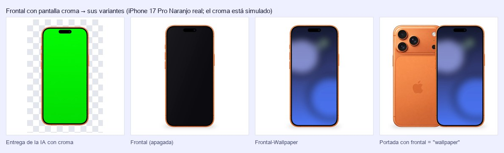
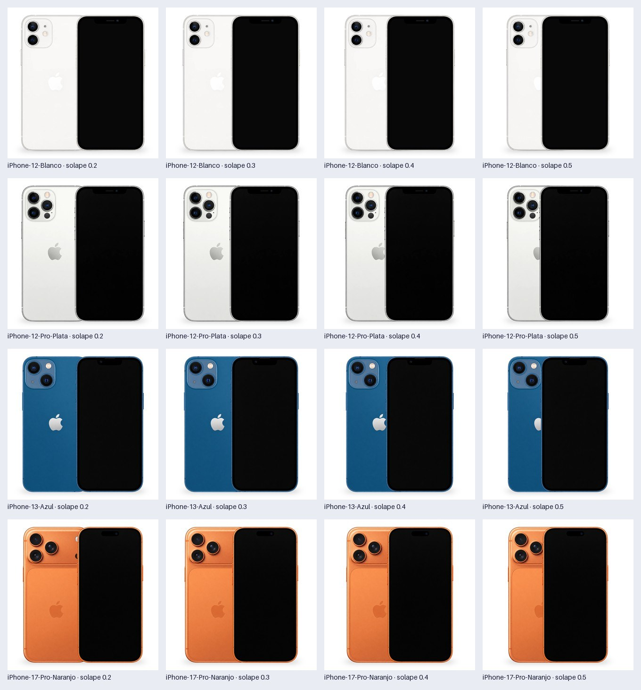

# Imágenes de producto

Pipeline para generar las imágenes de producto de Reuse (reuse.cl, reuse.mx, reuse.pe) a partir de las fotos originales de cada equipo.

Regla de diseño: **la IA solo crea las vistas; la geometría la hace un script.** Pedirle a un modelo generativo que centre o escale obliga a redibujar la imagen completa, y en ese redibujo puede cambiar el teléfono (cámaras, color, botones). Un error de ficha termina en cambios y devoluciones, así que la fidelidad al equipo real pesa más que la estética.

## Etapas

| # | Etapa | Qué hace | Estado |
|---|---|---|---|
| 1 | Generar | IA vía API: una llamada por vista (Lateral, Frontal, Trasera), con prompt fijo y siempre la misma referencia de estilo. | Implementada con OpenAI; falta probarla con la API real y compararla con Gemini |
| 2 | Estandarizar | Script determinista: quita el fondo, guarda un recorte maestro transparente, escala el teléfono a una altura fija y lo centra en un lienzo fijo. Arma las variantes de la Frontal (apagada y con wallpaper) y compone la Portada. Alerta ante problemas de recorte, pantalla, tamaño o peso. | Implementada; validada con imágenes sintéticas y con las generadas del iPhone 13 Azul y el 17 Pro Naranjo |
| 3 | Revisar | Control de fidelidad contra el original antes de publicar. | Por definir |
| 4 | Publicar | Subida a las tiendas Shopify. | Por definir |

Cada producto lleva 5 imágenes, en este orden: **Portada, Lateral, Frontal, Frontal-Wallpaper y Trasera**.

- **La Frontal sale en dos variantes**: con la pantalla apagada (`…-Frontal`) y con wallpaper (`…-Frontal-Wallpaper`). Se elige cuáles con `pantalla.variantes`. La IA genera una sola Frontal, con la pantalla en un color croma plano, y el script reemplaza ese color: las dos variantes tienen exactamente la misma geometría, y el notch o la Dynamic Island quedan como los dibujó la IA.
- **La Portada no se genera con IA**: se compone con los recortes de la Trasera (a la izquierda y detrás) y la Frontal (a la derecha y delante), del mismo alto. Cuánto se solapan, el desfase vertical, cuál va adelante y de qué lado se ajustan en `[portada]`; por defecto, la frontal tapa 1/6 de su ancho, como en la referencia.

### Qué pasa por defecto

Con el `config.toml` del repo, sin cambiar nada:

1. `imgprod generar` pide la Frontal con la pantalla en **verde croma** (`#00FF00`), porque `pantalla.variantes` incluye `"wallpaper"`. La Lateral y la Trasera se piden como siempre.
2. `imgprod estandarizar` deja **5 imágenes** por producto: Portada, Lateral, Frontal (apagada), Frontal-Wallpaper y Trasera.
3. La **Portada**:
   - usa la Frontal **apagada**, con la trasera a la izquierda y detrás;
   - con **solape 0,1667**: la frontal tapa 1/6 de su ancho, así que de la trasera se ve 5/6;
   - **sin desfase** vertical.
4. El wallpaper se busca en `estilo/wallpapers/`, que **hoy está vacía**. Mientras no haya un `_default.jpg` (o uno por modelo), la Frontal-Wallpaper no se genera y el comando termina con error (código 1). Las otras 4 imágenes salen igual.
5. Las Frontales generadas **antes** de este cambio tienen la pantalla negra, sin croma:
   - salen como Frontal, con la alerta `SIN_PANTALLA_CROMA`, y sin Frontal-Wallpaper;
   - para tener la de wallpaper, hay que regenerar la Frontal (~US$0,06 por producto).

Decisiones vigentes:

- **Frontal apagada y con wallpaper**; la Portada usa la apagada (`portada.frontal`).
- **Altura de 900 px** en todas las vistas y modelos. El prompt pide ~903 px en la Portada; las referencias van de 873 a 900.

## Instalación

Requiere Python 3.11 o superior. Funciona en macOS, Windows y Linux; solo cambia cómo se crea y se activa el entorno.

macOS / Linux:

```bash
python3.12 -m venv .venv
source .venv/bin/activate
pip install -e ".[dev]"
```

Windows (PowerShell), con Python instalado desde python.org o con `winget install Python.Python.3.12`:

```powershell
py -3.12 -m venv .venv
.venv\Scripts\Activate.ps1
pip install -e ".[dev]"
```

Si PowerShell no deja ejecutar el script de activación, corre antes `Set-ExecutionPolicy -Scope CurrentUser RemoteSigned`. Con el entorno activo, el comando `imgprod` y `pytest` funcionan igual en los tres sistemas.

### Claves de API

La etapa 1 (generar) usa APIs de pago. Copia `.env.example` como `.env` y completa las claves. `.env` no se sube a GitHub.

- `OPENAI_API_KEY`: clave de la **plataforma de API** de OpenAI (platform.openai.com), no de ChatGPT. La suscripción a ChatGPT no incluye la API: se paga aparte, con crédito prepagado. Conviene crear un proyecto propio para este pipeline, con un límite de gasto mensual.
- `GEMINI_API_KEY`: opcional, para comparar con Gemini (Google AI Studio).

## Uso

Los comandos se corren desde la carpeta del proyecto, con el entorno activo.

### Generar

```bash
imgprod generar "muestras/originales/iPhone 12 Azul.webp"
```

- El nombre del original da el modelo y el color: `<Modelo> <Color>.<ext>`. El color es la última palabra.
- Por cada vista (Lateral, Frontal, Trasera) hace una llamada a la API. Cada llamada envía tres cosas:
  - el original, recortado a su contenido para que la IA vea el equipo con el mayor detalle posible;
  - la referencia de estilo de esa vista;
  - el prompt de `estilo/prompts/`.
- Pide el teléfono con fondo transparente y sin sombra: la sombra y la geometría las pone la etapa 2.
- Si `pantalla.variantes` incluye `"wallpaper"`, la Frontal se pide con la pantalla llena de `pantalla.color_croma` (`estilo/prompts/pantalla-croma.md`); si no, apagada (`pantalla-apagada.md`).
- **Antes de gastar muestra el costo estimado y pide confirmación.** Con `--si` no la pide.
- Guarda lo generado en `generadas/<producto>/<Vista>.png`. Cada imagen va con un `.json` que registra modelo, prompt, tokens, costo real y tiempo.
- Luego lo estandariza en `salida/`, igual que `imgprod estandarizar`. Con `--solo-generar` se detiene antes.
- Modelo, calidad, medidas y cantidad de candidatas se ajustan en la sección `[generar]` de `config.toml`.

### Estandarizar

```bash
imgprod estandarizar carpeta/
```

Acepta imágenes con el nombre del catálogo (`iPhone-12-Azul-Version-Final-Frontal.webp`) o con la estructura `<producto>/<vista>.<ext>` (png, jpg o webp):

```
generadas/
└── iPhone-12-Azul/
    ├── lateral.png
    ├── frontal.png
    └── trasera.png
```

La salida queda en `salida/` (se cambia con `-s`; no se versiona):

```
salida/iPhone-12-Azul/
├── iPhone-12-Azul-Version-Final-Portada.webp             compuesta con la Trasera y la Frontal
├── iPhone-12-Azul-Version-Final-Lateral.webp
├── iPhone-12-Azul-Version-Final-Frontal.webp             pantalla apagada
├── iPhone-12-Azul-Version-Final-Frontal-Wallpaper.webp   la misma Frontal, con wallpaper
├── iPhone-12-Azul-Version-Final-Trasera.webp
├── maestros/                                   recortes transparentes sin escalar (PNG): permiten recomponer sin volver a generar
└── reporte.json                                medidas, escala, calidad, peso, wallpaper usado y alertas de cada vista
```

Cada imagen final mide 1000×1000, con el teléfono (o el par, en la Portada) a 900 px de alto y centrado, y con la misma sombra de contacto suave. Pesa como máximo 50 KB: se usa la mayor calidad WEBP que cumple ese peso. La altura y la sombra salen de medir las referencias de `estilo/referencias/`.

### Frontal con y sin wallpaper

La IA genera **una sola Frontal**, con la pantalla llena de un color croma plano. El script detecta ese color dentro del recorte y lo reemplaza. Así salen las dos variantes con exactamente la misma geometría, y el notch o la Dynamic Island quedan como los dibujó la IA.



Paso a paso:

1. **Deja el wallpaper** en `estilo/wallpapers/`. Se busca, en orden:
   - `<producto>.jpg`: solo ese color, p. ej. `iPhone-15-Pro-Azul.jpg`;
   - `<modelo>.jpg`: todos los colores del modelo, p. ej. `iPhone-15-Pro.jpg`;
   - `_default.jpg`: todo lo demás.

   También sirven `.png` y `.webp`. Ver [`estilo/wallpapers/README.md`](estilo/wallpapers/README.md). Hay uno de ejemplo en `muestras/wallpapers/ejemplo-reuse.jpg`, solo en este equipo: `muestras/` no se versiona.
2. **Genera** con `imgprod generar`: la Frontal ya se pide con la pantalla en croma. Para regenerar solo la Frontal de productos ya generados, pon `vistas = ["Frontal"]` en `[generar]` (una llamada por producto, ~US$0,06).
3. **Estandariza** con `imgprod estandarizar generadas/`: salen `…-Frontal.webp` (apagada) y `…-Frontal-Wallpaper.webp`.
4. Para que la **Portada** use la de wallpaper, pon `frontal = "wallpaper"` en `[portada]` y corre `imgprod portada`. Toma segundos: no vuelve a generar ni a quitar el fondo.

Cuáles salen se elige en `pantalla.variantes`:

| `variantes` | Qué sale | Qué se le pide a la IA |
|---|---|---|
| `["apagada", "wallpaper"]` (default) | Frontal y Frontal-Wallpaper | Pantalla croma |
| `["apagada"]` | Solo la Frontal, como antes de este cambio | Pantalla apagada (no hace falta wallpaper) |
| `["wallpaper"]` | Solo la Frontal-Wallpaper. Pide también `portada.frontal = "wallpaper"` | Pantalla croma |

| `[pantalla]` | Default | Qué hace |
|---|---|---|
| `variantes` | `["apagada", "wallpaper"]` | Qué Frontales salen (tabla anterior) |
| `color_croma` | `"#00FF00"` | Color plano que la IA pone en la pantalla y el script reemplaza. Tiene que ser un color saturado |
| `tolerancia_tono` | `[18, 40]` | Grados de tono: hasta el primero es croma; desde el segundo, no. Súbelos si la IA entrega un verde menos puro |
| `wallpapers` | `"estilo/wallpapers"` | Carpeta donde se buscan, o un archivo para usar el mismo en todos |
| `ancla_wallpaper` | `"centro"` | Si el wallpaper no calza con la pantalla, qué parte se conserva: `"centro"` o `"arriba"` |
| `color_apagada` | `"#0B0B0F"` | Color de la pantalla apagada que se arma desde el croma |
| `reflejo_apagada` | `0.06` | Reflejo diagonal de la pantalla apagada: 0 = negro plano |

Si la Frontal **no trae croma** (p. ej. se generó con la pantalla apagada), la variante apagada es la Frontal tal cual (alerta `SIN_PANTALLA_CROMA`) y la de wallpaper no se arma. Lo mismo si **falta el wallpaper**. En los dos casos la Frontal-Wallpaper aparece con ✗ y el comando termina con código 1.

### Portada

```bash
imgprod portada --solape 0,0.1667,0.3,0.45     # hoja para comparar solapes: salida/muestras-portada.jpg
imgprod portada                                # aplica [portada] de config.toml a todos los productos de salida/
```

`imgprod portada` vuelve a componer la Portada con los recortes maestros que dejó `estandarizar`, sin volver a quitar el fondo. Por eso cambiar el solape toma segundos, no una corrida completa. Con `--solape` no cambia ninguna imagen: arma una hoja con una fila por producto y una columna por valor. Acepta `salida/` (default) o la carpeta de un producto.

Para ajustar el solape:

1. Arma la hoja con los valores a comparar: `imgprod portada --solape 0.2,0.3,0.4`.
2. Elige un valor y ponlo como `solape` en `[portada]` de `config.toml`.
3. Aplícalo a todos los productos con `imgprod portada`.

La próxima corrida de `estandarizar` o `generar` usa el mismo valor.



| `[portada]` | Default | Qué hace |
|---|---|---|
| `solape` | `0.1667` | Fracción del ancho del teléfono de adelante que tapa al de atrás: 0 = se tocan, negativo = separados (de −0,5 a 0,95). Con 1/6, de la trasera se ve 5/6, como en la referencia |
| `desfase_vertical` | `0.0` | Fracción del alto: positivo baja la frontal respecto de la trasera |
| `adelante` | `"frontal"` | Cuál queda encima: `"frontal"` o `"trasera"` |
| `lado_trasera` | `"izquierda"` | `"izquierda"` o `"derecha"` |
| `frontal` | `"apagada"` | Qué Frontal va en la Portada: `"apagada"` o `"wallpaper"`. Si esa no está, usa la otra y alerta |

El par entero se lleva a 900 px de alto. Por eso, con más desfase vertical, cada teléfono queda más chico.

#### Por qué se quita el fondo

Para medir y mover el teléfono, el script necesita saber qué píxeles son teléfono y cuáles fondo. Medir "todo lo que no es blanco" no sirve por tres motivos:

- la sombra que dibuja la IA se contaría como parte del teléfono;
- un equipo blanco o plata sobre fondo blanco casi no se distingue del fondo;
- para componer la Portada hay que superponer los recortes, no imágenes con fondo.

Por eso cada imagen pasa primero a un recorte con fondo transparente:

- Si la imagen ya trae transparencia (la API de OpenAI puede entregarla), se usa tal cual.
- Si no (Gemini, o las imágenes que hoy salen de ChatGPT), la librería [rembg](https://github.com/danielgatis/rembg) lo hace con BiRefNet, un modelo de segmentación con licencia MIT. El modelo que rembg trae por defecto no permite uso comercial.
  - La primera vez descarga el modelo: 973 MB, en `~/.rembg/`.
  - En CPU tarda ~30–50 s por imagen.

La sombra de la IA se descarta con el fondo, y el script dibuja la suya, igual en todas las vistas.

Alertas (no detienen el proceso: quedan en pantalla y en `reporte.json`):

| Código | Significa |
|---|---|
| `AMPLIACION` | El producto es más chico que la altura final: hay que ampliarlo y puede verse borroso. |
| `TOCA_BORDE` | El producto toca el borde de la imagen de entrada: puede estar cortado. |
| `VARIOS_OBJETOS` | Hay más de un objeto en la imagen. |
| `HUECOS_RELLENADOS` | El recorte tenía huecos dentro del producto y se rellenaron con la imagen original: revisar el recorte. |
| `PROPORCIONES_DISTINTAS` | La Frontal y la Trasera no tienen la misma proporción ancho/alto: una de las dos puede estar deformada. |
| `SIN_PANTALLA_CROMA` | Se pidió la Frontal con wallpaper, pero la Frontal no trae la pantalla en color croma: se usó tal cual como Frontal y la Frontal-Wallpaper no se armó. |
| `PANTALLA_CON_ELEMENTOS` | La IA dibujó hora, íconos o texto sobre la pantalla croma (la Dynamic Island no cuenta): regenerar la Frontal. |
| `PORTADA_CON_OTRA_FRONTAL` | No estaba la variante de `portada.frontal` y la Portada se armó con la otra. |
| `LIMITADO_POR_ANCHO` | El producto es tan ancho que no cabe a la altura estándar y quedó más bajo. |
| `DESBORDA_LIENZO` | Parte del recorte (halo o sombra) quedó fuera del lienzo. |
| `PESO_EXCEDIDO` | Ni con la calidad mínima se llega al peso máximo. |
| `ORIGINAL_CHICO` | Al generar: en el original el equipo ocupa pocos píxeles, así que la IA tiene poco detalle para ser fiel. |

## Configuración

Todo se ajusta en [`config.toml`](config.toml): lienzo, altura del producto, composición de la Portada, pantalla de la Frontal y wallpapers, sombra, formato, peso, nombre de archivo y umbrales de las alertas. Los defaults están en `src/imagenes_producto/config.py`.

`portada.visible_trasera` se reemplazó por `portada.solape`. Una configuración vieja da un error que lo explica.

- Con la trasera y la frontal del mismo ancho, `solape = 1 − visible_trasera`.
- Antes quedaba fija la parte visible de la trasera; ahora queda fijo cuánto la tapa la frontal. En las generadas hasta ahora, la IA dibujó la trasera y la frontal con ~2 % de diferencia de ancho, así que la frontal se corre unos 8–9 px de 1000 respecto de las Portadas anteriores.

## Estructura

```
config.toml               parámetros del pipeline
docs/                     explicación del pipeline (pipeline.html) y brief para otra IA (referencia.md)
estilo/                   receta fija de generación: prompt, referencias de estilo y wallpapers (se versiona)
muestras/                 material de ejemplo del proceso actual (no se versiona)
src/imagenes_producto/    código: config, imagen (lectura y escritura), fondo, pantalla, estandarizar, generar, cli
tests/                    pruebas
```

## Documentación

- [`docs/pipeline.html`](docs/pipeline.html): el pipeline completo, con diagramas, entradas y salidas de cada etapa, y los parámetros.
- [`docs/referencia.md`](docs/referencia.md): brief autocontenido para seguir el proyecto con otra IA. Incluye las etapas pendientes (Revisar y Publicar) con su diseño propuesto.

## Pruebas

```bash
pytest
```

En GitHub, las pruebas corren solas en Linux y Windows con cada cambio (`.github/workflows/pruebas.yml`).
